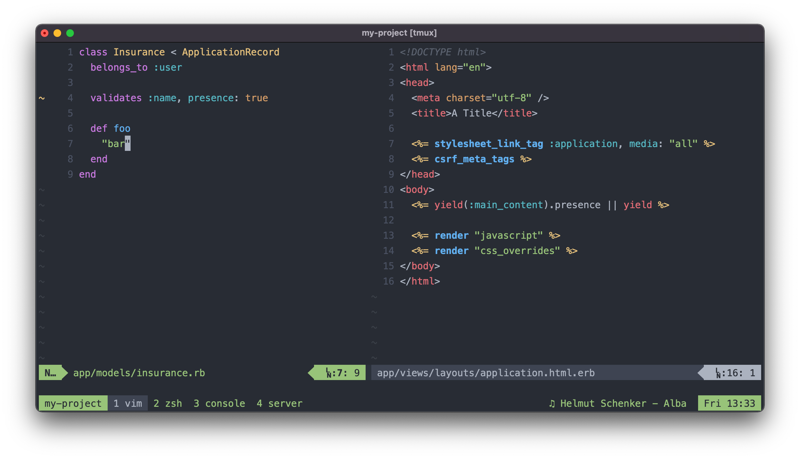

# shanson's dotfiles

These dotfiles set up Zsh, Vim, and tmux, and are also used to back up iTerm
config and manage other program dotfiles, like `asdf` and `git`. Some of this
configuration is borrowed from [thoughtbot's dotfiles][thoughtfiles].
thoughtbot's [rcm][rcm] is used to manage creating symlinks to the home
directory.



## Setting up a new computer

When setting up a new computer, the [thoughtbot
Laptop](https://github.com/thoughtbot/laptop) script should be used. The
`laptop.local` script customization is managed in this repo. Clone this
repo down to `~/dotfiles` and manually copy `laptop.local` to `~/.laptop.local` (`ln -s
    ~/dotfiles/laptop.local ~/.laptop.local`) and then run the
Laptop script. 

After the laptop script finishes, continue setting up the dotfiles, according to the instructions.

## Installation

Set zsh as your login shell:

```bash
chsh -s $(which zsh)
```

Then, clone or fork this repo into `~/dotfiles`.

Install [rcm][rcm]:

```bash
brew tap thoughtbot/formulae
brew install rcm
```

Install the dotfiles:

```bash
env RCRC=$HOME/dotfiles/rcrc rcup
```

Any files in this repo that are not prefixed with a `.` are automatically copied
to the home directory when `rcup` is run. After this initial `rcup`, the `RCRC`
ENV variable does not need to be manually specified.

For more information on what happens with `rcup`, see the [thoughtbot dotfiles
repo][thoughtfiles].

[thoughtfiles]: https://github.com/thoughtbot/dotfiles
[rcm]: https://github.com/thoughtbot/rcm
